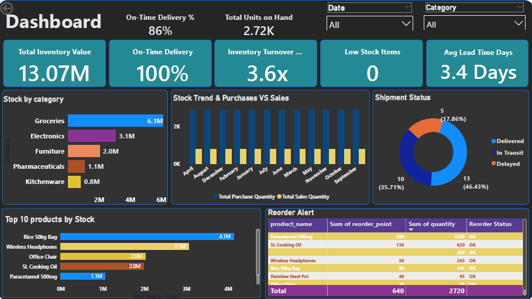
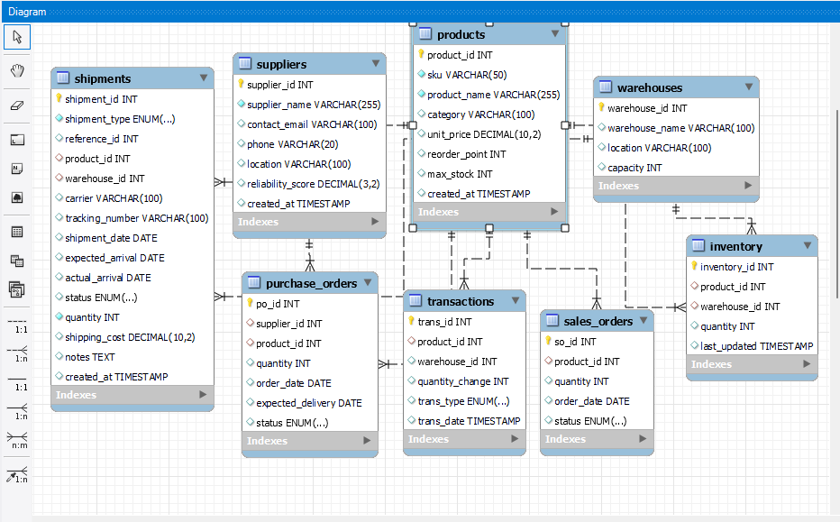
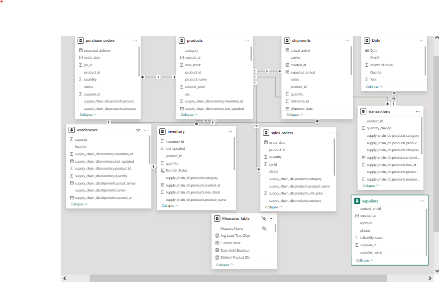

# Supply Chain & Inventory Management Dashboard

**End-to-End MySQL + Power BI Solution** for real-time supply chain visibility and inventory analytics.



## 🚀 Live Interactive Dashboard

**[View Interactive Supply Chain Dashboard](https://app.powerbi.com/view?r=your-link-here)**  
*(Replace with your actual published Power BI link)*

## 📥 Download Power BI File

**[Download Supply_Chain_Inventory_Dashboard.pbix](Supply_Chain_Inventory_Dashboard.pbix)**  
*(Fully interactive .pbix file - Open with Power BI Desktop)*

## 📋 Project Overview

A complete supply chain and inventory management analytics solution built with **MySQL** as the backend database and **Microsoft Power BI** for advanced reporting and visualization.

Stakeholders can monitor inventory levels, shipment performance, purchasing activities, sales trends, and warehouse operations in real time.

## 🛠️ Technology Stack

| Technology   | Purpose                          |
|--------------|----------------------------------|
| MySQL        | Database & Data Storage          |
| SQL          | Querying & Transformation        |
| Power BI     | Dashboard & Reporting            |
| DAX          | KPI Calculations                 |
| Power Query  | Data Preparation                 |
| GitHub       | Version Control                  |

## 🗄️ Database Schema



## 📊 Power BI Data Model



## ✨ Key Features

- Real-time inventory valuation
- On-time delivery tracking
- Purchase vs Sales analysis
- Low stock & reorder point alerts
- Category-wise inventory distribution
- Top products by stock value
- Interactive filtering and drill-downs

## 📈 Dashboard Highlights (June 2026)

| KPI                        | Value            |
|---------------------------|------------------|
| Total Inventory Value     | ₦13.07 Million  |
| On-Time Delivery Rate     | 100%            |
| Inventory Turnover        | 3.6x            |
| Average Lead Time         | 3.4 Days        |
| Low Stock Items           | 0               |

## 📄 Executive Report

**[Download Executive Report](Supply_Chain_Executive_Report.pdf)**

## 📁 Project Structure

Supply-Chain-Inventory-Management-Dashboard/
├── 01_schema.sql
├── 02_sample_data.sql
├── Supply_Chain_Inventory_Dashboard.pbix     ← Main Power BI file
├── Supply_Chain_Executive_Report.pdf
├── dashboard-screenshot.png
├── mysql-schema.png
├── powerbi-model.png
├── executive-cover.png
├── README.md
├── LICENSE
└── .gitignore


## ⚙️ How to Set Up

### 1. Database Setup
```sql
CREATE DATABASE supply_chain_db;
USE supply_chain_db;

SOURCE 01_schema.sql;
SOURCE 02_sample_data.sql;

2. Open Power BI Dashboard

Download and open Supply_Chain_Inventory_Dashboard.pbix
Update the MySQL connection (server, database, credentials)
Click Refresh to load the latest data
Explore the interactive visuals

📐 Sample DAX Measures

Inventory Turnover = 
DIVIDE([Total Sales], [Average Inventory])

On Time Delivery % = 
DIVIDE([On Time Deliveries], [Total Deliveries])

Current Stock = 
SUM(Inventory[quantity])

🔍 Key Insights

Achieved 100% on-time delivery
Healthy inventory turnover of 3.6x
No low-stock items
Average lead time of 3.4 days

🔮 Future Enhancements

Deploy to Power BI Service
Scheduled data refresh
Demand forecasting
Supplier performance scorecards
Row-Level Security (RLS)


Prepared by
Boniface Anuforo
Power BI Developer | Data Analyst | Supply Chain Analyst

GitHub
LinkedIn

⭐ If you find this project useful, please star the repository!
